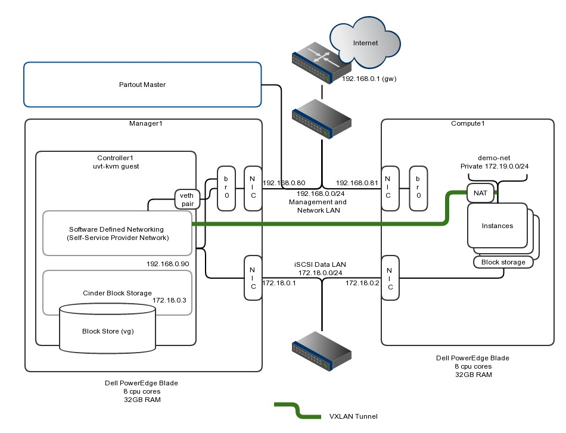

# Create a Dev OpenStack Private Cloud using the Partout DevOps Tool

(See [Partout on GitHub](https://github.com/partoutx/partout))



(these notes are pretty rough - this is a work in progress...)

## Kit

* 2 x Dell PowerEdge Blades

## Prereqs

* A deployed [Partout](https://github.com/partoutx/partout) master with this git project cloned as a site manifest, e.g.:

```
    cd /opt/partout/etc/manifest
    git clone git@github.com:gbevan/partout_openstack_poc.git openstack
```

## Setup

* The two blades have Ubuntu Server 14.04 LTS installed
* As the controller node is a uvt-kvm virtual machine running on manager1, grub needed tweaking with:

    GRUB_CMDLINE_LINUX_DEFAULT="iommu=memaper=3"

* Mount the partout_agent share from the partout master (or download it):

```
    your_master_node:/opt/partout/agent /opt/partout/agent nfs _netdev,ro,nolock,intr,bg 0 0
```

* Review the site.p2 for your site setup - it makes some hardcoded assumptions on node naming and their roles.
* Run partout-agent on the manager1 node:

```
    cd /opt/partout/agent
    bin/partout-agent --once -y
```

* This will start the controller1 uvt-kvm virtual guest and start partout-agent to configure it.  Monitor progress in controller1 by tailing file ```/var/log/cloud-init-output.log```.
* The agent's SSL Certificate Signing Request will need to be signed on the master using:

```
    cd /opt/partout
    bin/partout csr list
    bin/partout csr sign uuid-of-agent
```

You need to set this agent to be in the openstack environment, on the master:
```
    bin/partout setenv uuid-of-agent openstack
```

* Repeat mounting the partout agent share and running ```partout-agent --once --env openstack``` on the compute1 node.
* Once complete login to ```http://controller1/horizon```.

---

## Misc Notes

### Brackets Syntax highlighting

```js
{
  "language": {
    "javascript": {
      "linting.prefer": ["JSHint"],
      "linting.usePreferredOnly": true
    }
  },
  "language.fileExtensions": {
    "p2": "javascript"
  }
}
```

COPYRIGHT
---------
   ```
    Partout [Everywhere] - Policy-Based Configuration Management for the
    Data-Driven-Infrastructure.

    Copyright (C) 2015-2016 Graham Lee Bevan <graham.bevan@ntlworld.com>

    This project is part of Partout - https://github.com/partoutx/partout.

    Partout is free software: you can redistribute it and/or modify
    it under the terms of the GNU General Public License as published by
    the Free Software Foundation, either version 3 of the License, or
    (at your option) any later version.

    This program is distributed in the hope that it will be useful,
    but WITHOUT ANY WARRANTY; without even the implied warranty of
    MERCHANTABILITY or FITNESS FOR A PARTICULAR PURPOSE.  See the
    GNU General Public License for more details.

    You should have received a copy of the GNU General Public License
    along with this program.  If not, see <http://www.gnu.org/licenses/>.
```

